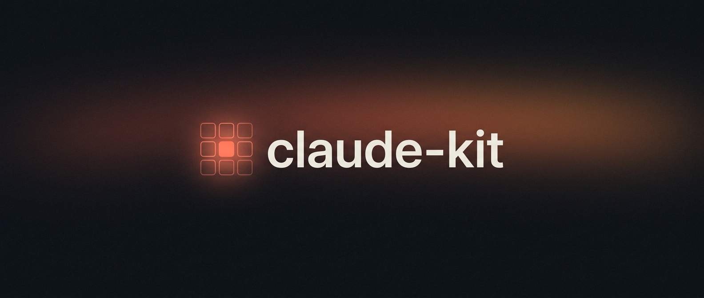

# claude-kit



[](https://skills.sh/CryptoGnome/claude-kit)
[](https://github.com/CryptoGnome/claude-kit/releases)
[](LICENSE)

> CryptoGnome's curated, minimal, opinionated Claude Code skills. Install once, use on every project, keep in sync, share with anyone.

Not a kitchen-sink mega-pack — a small, ruthlessly-curated set written *our way*: the best parts of the skills worth borrowing, stripped to their essence, portable across projects, and free of machine-specific defaults and secrets.

## Quickstart

1. **Add the marketplace + install** (in Claude Code):
   ```
   /plugin marketplace add CryptoGnome/claude-kit
   /plugin install claude-kit@claude-kit
   ```
2. **Restart your session** — the skills load and the always-on `lazy-surgical` hook activates.
3. **Just work.** Skills fire automatically when your task matches; or run any explicitly with `/<name>` (e.g. `/security-audit`).

No config. Works with any model.

<details><summary>Other ways to install</summary>

**`skills` CLI (copy-and-own):**
```
npx skills add CryptoGnome/claude-kit                    # the whole kit
npx skills add CryptoGnome/claude-kit --skill research   # just one
npx skills add CryptoGnome/claude-kit --list             # list what's inside
```

**Manual:**
```bash
git clone https://github.com/CryptoGnome/claude-kit.git
cp -r claude-kit/skills/research ~/.claude/skills/       # personal (all projects)
```
</details>

## Update
`/plugin marketplace update claude-kit` (or enable auto-update in `/plugin`) pulls new versions and skills. Manual/CLI installs: `git pull` and re-run `npx skills add`. See [CHANGELOG.md](CHANGELOG.md).

## Why these exist

Each skill removes a specific pain of coding with an AI agent:

- **The agent over-builds or drifts** → `lazy-surgical` (least code, surgical diffs) + `grill` (align before building) + `research` (get the facts first).
- **The output looks like generic AI** → `anti-slop-frontend` / `redesign-existing-projects` for UI, `marketing-copy` / `seo-geo-aeo` for words.
- **Security & quality slip through** → `security-audit` (agent-powered vuln audit), `a11y-audit`, `react-best-practices`.
- **Crypto code is easy to get wrong** → `ethereum` and `solana` (chain-specific security + tooling).
- **Hard bugs, murky design, no plan** → `diagnosing-bugs` (feedback-loop-first debugging), `codebase-design` (deep modules), `prototype` (throwaway code to settle a design question), `plan-to-issues` (PRD → vertical slices).
- **The workflow glue** → `semver`, `handoff`, `caveman`, `image-gen`, `remotion`.

## Skills

Twenty-one skills, grouped by what they're for. **All are model-invoked** — Claude reaches for them automatically when your task matches, or you name them with `/<name>` (`handoff` is invoke-only).

### Coding discipline & craft
| Skill | What it does | Secrets |
|---|---|---|
| [`lazy-surgical`](skills/lazy-surgical/SKILL.md) | The least code that fully solves it — reuse first, surgical diffs, simple, verifiable (`lite`/`full`/`ultra`). Always-on via hook | none |
| [`codebase-design`](skills/codebase-design/SKILL.md) | Design deep modules — lots of behaviour behind a small interface at a clean seam, testable through it (precise shared vocabulary) | none |
| [`diagnosing-bugs`](skills/diagnosing-bugs/SKILL.md) | Feedback-loop-first debugging for hard/flaky bugs & perf regressions — reproduce → minimise → hypothesise → instrument → fix | none |
| [`security-audit`](skills/security-audit/SKILL.md) | Deep vulnerability audit via parallel subagents — triage → source→sink → adversarial FP cull → ranked findings (no paid tools) | none |
| [`caveman`](skills/caveman/SKILL.md) | Terse-output mode — strips filler, keeps every fact/command exact (`lite`/`full`/`ultra`) | none |
| [`semver`](skills/semver/SKILL.md) | The correct next version via SemVer — major/minor/patch, the 0.x rule, changelog→tag flow | none |

### Planning & workflow
| Skill | What it does | Secrets |
|---|---|---|
| [`grill`](skills/grill/SKILL.md) | Interrogate the plan (one question at a time, with recommended answers) until aligned, before any code | none |
| [`research`](skills/research/SKILL.md) | Delegate reading legwork to a background agent — investigate PRIMARY sources → a cited Markdown note to work against | none |
| [`prototype`](skills/prototype/SKILL.md) | Throwaway prototype to settle ONE design question — a terminal app for state/logic, or toggleable UI variants | none |
| [`plan-to-issues`](skills/plan-to-issues/SKILL.md) | Synthesize a PRD (no interview) then cut it into end-to-end vertical-slice issues — via `gh` or markdown | none |
| [`handoff`](skills/handoff/SKILL.md) | Compact the session into a standalone handoff doc for a fresh agent (invoke-only) | none |

### Frontend & design
| Skill | What it does | Secrets |
|---|---|---|
| [`anti-slop-frontend`](skills/anti-slop-frontend/SKILL.md) | Anti-slop guardrails for NEW UI — design read, dials, countable layout rules, em-dash ban | none |
| [`redesign-existing-projects`](skills/redesign-existing-projects/SKILL.md) | Upgrade an EXISTING site without breaking it — audit + prioritized fixes, any stack | none |
| [`a11y-audit`](skills/a11y-audit/SKILL.md) | Audit UI code for accessibility/UX violations → terse `file:line` findings | none |
| [`react-best-practices`](skills/react-best-practices/SKILL.md) | Fix React/Next.js perf + component architecture in impact order (waterfalls, bundles, RSC) | none |

### Content & visuals
| Skill | What it does | Secrets |
|---|---|---|
| [`marketing-copy`](skills/marketing-copy/SKILL.md) | High-converting copy — positioning, headline/CTA formulas, page structure, offer & objection frameworks | none |
| [`seo-geo-aeo`](skills/seo-geo-aeo/SKILL.md) | Search & AI-answer readiness audit — SEO + AEO + GEO checklists, schema, a 1–10 scored report | none |
| [`image-gen`](skills/image-gen/SKILL.md) | Generate any image via OpenRouter (Gemini / GPT / FLUX / Seedream / Grok) + prompt/style help | OpenRouter key |
| [`remotion`](skills/remotion/SKILL.md) | Programmatic video in React (Remotion) — frame-driven animation, deterministic rendering, sequencing | none |

### Web3 / crypto
| Skill | What it does | Secrets |
|---|---|---|
| [`ethereum`](skills/ethereum/SKILL.md) | Production EVM — Solidity security, Foundry testing, gas/L2 choices, Scaffold-ETH 2 / viem / wagmi | none |
| [`solana`](skills/solana/SKILL.md) | Production Solana — @solana/kit, Anchor & Pinocchio, PDAs/CPIs, Token-2022, program security, testing | none |

## Always-on discipline

> [!NOTE]
> You don't have to type slash commands — most skills **auto-activate by description**. The one exception by design is `lazy-surgical`: it's a coding *temperament* for every edit, so the kit ships a `SessionStart` hook ([`hooks/hooks.json`](hooks/hooks.json) → [`hooks/session-start.js`](hooks/session-start.js)) that injects it into **every session**. Turn it off by disabling the plugin in `/plugin` or deleting `hooks/hooks.json`. (Needs Node.js; skipped harmlessly if absent. The file is auto-loaded, so it's intentionally not declared in `plugin.json`.)

## Philosophy

- **Subtraction over accumulation.** A skill earns its place or it's cut.
- **One skill = one job.** Split anything that does two things.
- **Rules as countable checks, not vibes.** "≤ 4 elements", "trace every line to the request" — not "use good judgment".
- **Trigger-engineered descriptions.** Each skill says exactly when to fire and when *not* to.
- **Portable & safe by default.** No machine-specific paths, no committed secrets, ever.

## Adding a skill

Every skill clears the bar in [GOVERNANCE.md](GOVERNANCE.md) before it lands: one job per skill, a trigger-engineered description, countable rules over vibes, and a hard **no committed secrets / no machine-specific paths** audit. Versioning follows the [`semver`](skills/semver/SKILL.md) skill; minor & milestone releases get a GitHub Release. New skills are distilled *in our own way* from the best sources — credited, never blindly vendored.

## License

[MIT](LICENSE) © CryptoGnome
